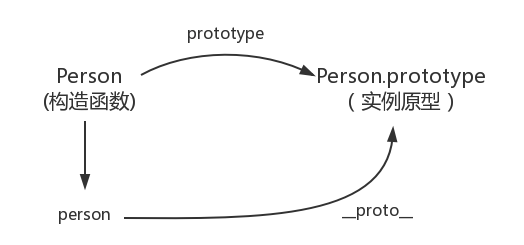
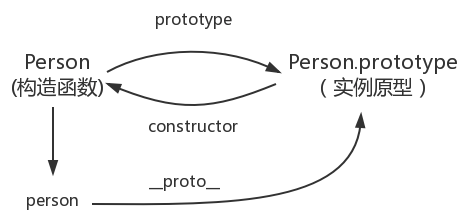
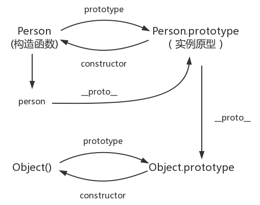
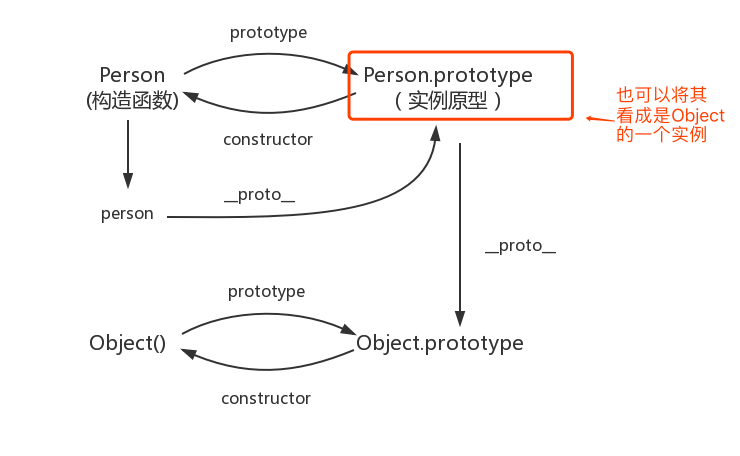
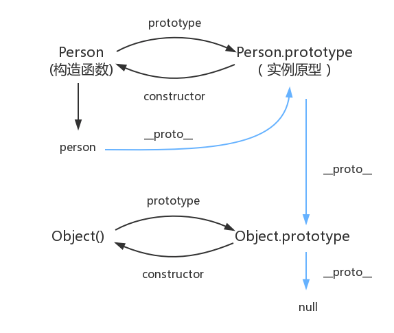

先总结一个公式:
var 对象 = new 构造函数()  <br>
对象.`__proto__` === 构造函数.prototype
## 使用构造函数创建对象
```
function Person(){
}
var person = new Person();
person.name = "Kevin";
console.log(person.name)// Kevin
```
在这个例子中，Person 就是一个构造函数，我们使用 new 创建了一个实例对象 person。
## prototype
每个函数都有一个prototype属性，就是我们经常在各种例子中看到的那个prototype,比如:
```
function Person(){
}
//
Person.prototype.name='Kevin';
var person1 = new Person();
var person2 = new Person();
console.log(person1.name)// Kevin
console.log(person2.name)// Kevin
```
函数的 prototype 属性指向了一个对象，这个对象正是调用该构造函数而创建的实例的原型，也就是这个例子中的 person1 和 person2 的原型。
那什么是原型呢？你可以这样理解：每一个JavaScript对象(null除外)在创建的时候就会与之关联另一个对象，这个对象就是我们所说的原型，每一个对象都会从原型"继承"属性。
让我们用一张图表示构造函数和实例原型之间的关系：

在这张图中我们用 Object.prototype 表示实例原型。
那么我们该怎么表示实例与实例原型，也就是 person 和 Person.prototype 之间的关系呢，这时候我们就要讲到第二个属性：
## `__proto__`
这是每一个JavaScript对象(除了 null )都具有的一个属性，叫__proto__，这个属性会指向该对象的原型。
```
function Person() {


}
var person = new Person();
console.log(person.__proto__ === Person.prototype)//true
```



既然实例对象和构造函数都可以指向原型，那么原型是否有属性指向构造函数或者实例呢？
## constructor
指向实例倒是没有，因为一个构造函数可以生成多个实例，但是原型指向构造函数倒是有的，这就要讲到第三个属性：constructor，每个原型都有一个 constructor 属性指向关联的构造函数。
验证:
```
function Person() {


}
console.log(Person === Person.prototype.constructor); // true 
```



到目前为止，可以得到一下结论:
```
function Person() {


}


var person = new Person();


console.log(person.__proto__ == Person.prototype) // true


console.log(Person.prototype.constructor == Person) // true


// 顺便学习一个ES5的方法,可以获得对象的原型


console.log(Object.getPrototypeOf(person) === Person.prototype) // true
```
了解了构造函数、实例原型、和实例之间的关系，接下来我们讲讲实例和原型的关系：
## 实例与原型(有句话比较重要)
当读取实例的属性时，如果找不到，就会查找与对象关联的原型中的属性，如果还查不到，就去找原型的原型，一直找到最顶层为止。
```
function Person() {


}


Person.prototype.name = 'Kevin';


var person = new Person();


person.name = 'Daisy';


console.log(person.name) // Daisy


delete person.name;


console.log(person.name) // Kevin
```
在这个例子中，我们给实例对象 person 添加了 name 属性，当我们打印 person.name 的时候，结果自然为 Daisy。


但是当我们删除了 person 的 name 属性时，读取 person.name，从 person 对象中找不到 name 属性就会从 person 的原型也就是 person.__proto__ ，也就是 Person.prototype中查找，幸运的是我们找到了 name 属性，结果为 Kevin。


但是万一还没有找到呢？原型的原型又是什么呢？
## 原型的原型
在前面，我们已经讲了原型也是一个对象，既然是对象，我们就可以用最原始的方式创建它，那就是：
```
var obj = new Object();


obj.name = 'Kevin'


console.log(obj.name) // Kevin
```
其实原型对象就是通过 Object 构造函数生成的，结合之前所讲，实例的 `__proto__ `指向构造函数的 prototype ，所以我们再更新下关系图：




## 原型链
那 Object.prototype 的原型呢？
null，我们可以打印：
```
console.log(Object.prototype.__proto__ === null) // true
```
然而 null 究竟代表了什么呢？
引用阮一峰老师的 《undefined与null的区别》 就是：
> null 表示“没有对象”，即该处不应该有值。


所以 Object.prototype.__proto__ 的值为 null 跟 Object.prototype 没有原型，其实表达了一个意思。


所以查找属性的时候查到 Object.prototype 就可以停止查找了。


最后一张关系图也可以更新为：

顺便还要说一下，图中由相互关联的原型组成的链状结构就是原型链，也就是蓝色的这条线。
## 补充
### constructor
首先是 constructor 属性，我们看个例子：
```
function Person() {


}


var person = new Person();


console.log(person.constructor === Person); // true
console.log(person.constructor === Person.prototype.constructor); // true
```
当获取 person.constructor 时，其实 person 中并没有 constructor 属性,当不能读取到constructor 属性时，会从 person 的原型也就是 Person.prototype 中读取，正好原型中有该属性，所以：
```
console.log(person.constructor === Person.prototype.constructor); // true
```
### `__proto__`
其次是` __proto__` ，绝大部分浏览器都支持这个非标准的方法访问原型，然而它并不存在于 `Person.prototype `中，实际上，它是来自于 `Object.prototype `，与其说是一个属性，不如说是一个 `getter/setter`，当使用 `obj.__proto__ `时，可以理解成返回了 `Object.getPrototypeOf(obj)`。
### 真的是继承吗？
最后是关于继承，前面我们讲到“每一个对象都会从原型‘继承’属性”，实际上，继承是一个十分具有迷惑性的说法，引用《你不知道的JavaScript》中的话，就是：


继承意味着复制操作，然而 JavaScript 默认并不会复制对象的属性，相反，JavaScript 只是在两个对象之间创建一个关联，这样，一个对象就可以通过委托访问另一个对象的属性和函数，所以与其叫继承，委托的说法反而更准确些。
