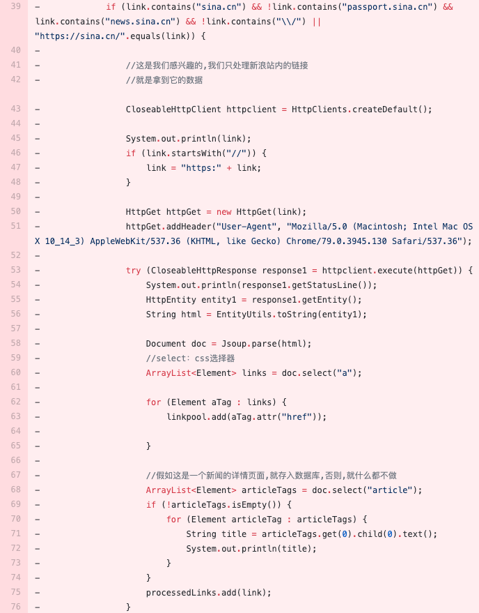
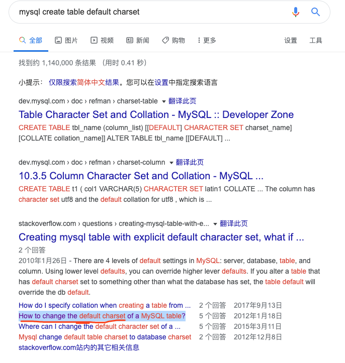
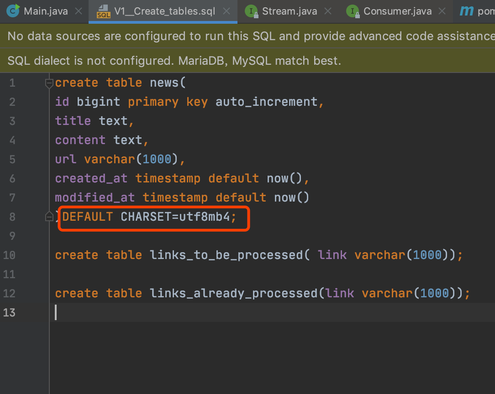

[TOC]
## 项目地址
[项目地址](https://github.com/richard1230/crawler)

## 重构相关的实践与思考

其实很久很久以前，我觉得写代码不就是堆积功能么，但是，当我看了设计模式和重构之后，我的观点发生了翻天覆地的变化(尤其是后者)，让我自己感觉对以前写的代码羞愧不已，下面我们就以这个项目为例，来实践一下重构;

篇幅限制，这里只展示重构的地方，想要看具体的原来的所有源代码，可以看下面的链接:

[需要重构部分的代码](https://github.com/richard1230/crawler/commit/e3576d42c4d5aebc0e5a52583b47b0cdeb7fb271)

 <br>

这个Main函数里面的代码快超过100行了，如果继续添加，可能会超过1000行，乃至上万行,这是非常不利于维护的；故我们在开发的过程中就要进行重构;<br>

首先找到的第一个坏代码的味道，就是整个函数太过于冗长（整个逻辑交织在一起）；<br>

然后再细看:发现第33行的if括号中的条件表达式又臭又长，可以将其提取成一个可以自己解释自己干什么的函数（自解释函数）;<br>

上面讲到整个函数里面的逻辑都交织在一起，让人感觉没有层次感，逻辑不清晰，这是我们不希望看到的; <br>

下面将整个函数划分为几个模块:<br>

1.获取http并解析html (43-58行)；<br>

2.利用Java8特性重构60-63行；<br>

3.将为新闻类型的数据存储在数据库中否则什么也不做 （68-72行需要抽离出一个函数）<br>

下面给出重构之后的代码:<br>

```java
		[...]
  	        if(isInterestingLink(link)){
			Document doc=httpGetAndParseHtml(link);
			doc.select("a").stream().map(aTag->aTag.attr("href")).forEach(linkpool::add);
			StoreIntoDatabaseIfItisNewsPage(doc);
			processedLinks.add(link);
		}else{
			continue;
		}
		[...]
  

	private static void StoreIntoDatabaseIfItisNewsPage(Document doc){
		ArrayList<Element> articleTags=doc.select("article");
		if(!articleTags.isEmpty()){
			for(Element articleTag:articleTags){
				String title=articleTags.get(0).child(0).text();
				System.out.println(title);
			}
		}
	}

	private static Document httpGetAndParseHtml(String link){
		CloseableHttpClient httpclient=HttpClients.createDefault();
		System.out.println(link);
		if(link.startsWith("//")){
			link="https:"+link;
		}
		HttpGet httpGet=new HttpGet(link);
		httpGet.addHeader("User-Agent","Mozilla/5.0 (Macintosh; Intel Mac OS X 10_14_3)
				AppleWebKit/537.36(KHTML,like Gecko)Chrome/79.0.3945.130Safari/537.36");

		try(CloseableHttpResponse response1=httpclient.execute(httpGet))
		{
			System.out.println(response1.getStatusLine());
			HttpEntity entity1=response1.getEntity();
			String html=EntityUtils.toString(entity1);
			return Jsoup.parse(html);
		}
	}

	private static boolean isInterestingLink(String link){
		return  IsHomePage(link)
				&&IsNewsPage(link)
				&&IsillegalString(link)
				||IsIndexPage(link)
				&&IsNotLoginPage(link);
	}

	private static boolean IsHomePage(String link){
		return link.contains("sina.cn");
	}

	private static boolean IsIndexPage(String link){
		return"https://sina.cn/".equals(link);
	}

	private static boolean IsillegalString(String link){
		return!link.contains("\\/");
	}

	private static boolean IsNewsPage(String link){
		return link.contains("news.sina.cn");
	}

	private static boolean IsNotLoginPage(String link){
		return!link.contains("passport.sina.cn");
	}
```
可以发现重构之后，每个函数的大小至多10行上下，函数的名字也易读(自解释函数)，整个函数可读性非常强;


## 使用Mysql过程中遇到的一些问题与总结
### 1.实现数据的自动化迁移
之前在写项目中sql语句来进行测试的时候，发现每次测试的时候总要吧sql语句重写一遍,感觉很麻烦，于是引入flyway实现数据的自动化迁移
```
$mvn flyway:clean
$mvn flyway:migrate
```
### 2.数据库迁移的时候发生错误
重建数据库（生产环境要慎重!!!）或者利用类似回滚的办法


### 3.创建迁移脚本时候需要注意名字里面有两个下划线
比如:`V1__Create_tables.sql`


### 4.编码问题
google: jdbc utf8 alter database

在`config.xml`和`pom.xml`里面添加下面这句话:
`?characterEncoding=utf-8`

### 5.utf8的坑
mysql里面的一个坑:utf8不是正宗的utf8,而utf8mb4才是正宗的utf8!!!





## git撤销与回滚
撤销git add .
```
$git rm -r -f --cached .

```
撤销Git init
```
$rm -rf .git

```
撤销 `git commit ` </br>

具体情况:

当执行了`git commit -m "xxx"`之后，发现这么一个错误:(或者想取消这次的提交)
```
 ! [rejected]        master -> master (fetch first)
error: failed to push some refs to 'git@github.com:richard1230/myblog.git'
hint: Updates were rejected because the remote contains work that you do
hint: not have locally. This is usually caused by another repository pushing
hint: to the same ref. You may want to first integrate the remote changes
hint: (e.g., 'git pull ...') before pushing again.
hint: See the 'Note about fast-forwards' in 'git push --help' for details.
```
其中的一种比较简单的方案就是直接回滚到上一次提交
```
git reset  上一次提交的id
```


