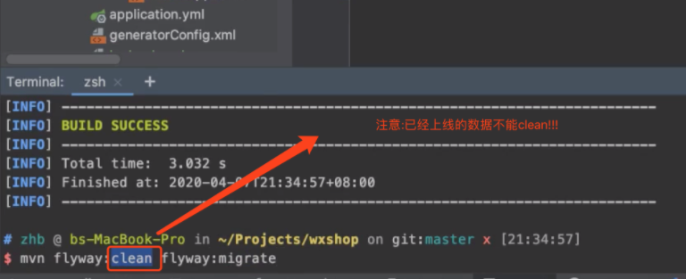
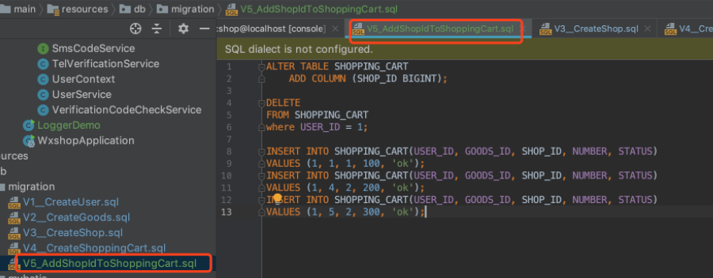
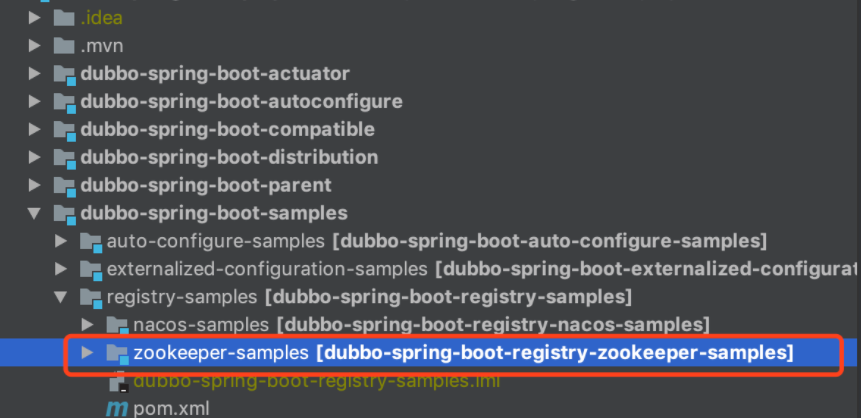
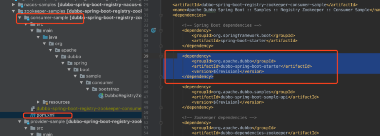
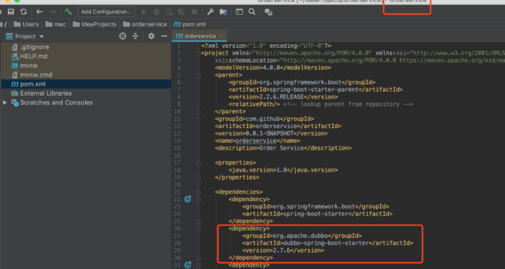
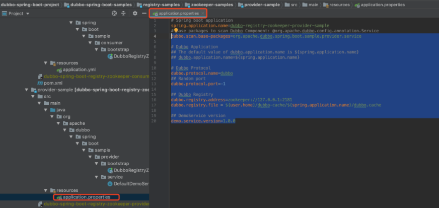

[TOC]
## 前言
这里主要总结一下在做电商这个项目里面所遇到的问题以及相关知识点总结,整个项目实现的功能有:<br>
1.基于手机验证码的登录<br>

2.买家可以编辑个人信息/收货地址，商品浏览，添加购物车，下单，付款，查看物流信息，确认收货<br>


3.卖家可以新建/修改店铺，添加/编辑/删除宝贝，查看订单，发货<br>

[项目源代码地址](https://github.com/richard1230/wxshop)
## Authentication和Authorization之间的区别
Authentication: 鉴权
Authorization：授权
打个比方:
你要登陆论坛，输入用户名张三，密码1234，密码正确，证明你张三确实是张三，这就是 authentication；再一检查用户张三是个版主，所以有权限加精删别人帖，这就是 authorization。
## 指定端口启动Spring Boot服务端
```
java -jar ./target/spring-boot-0.0.1-SNAPSHOT.jar --server.port=9090
```
##  自动化测试与集成测试相关
1.使用Checkstyle代码规范检查工具；
2.使用SpotBug代码缺陷检查工具；
3.使用jacoco生成测试覆盖率
4.使用Junit5来实践单元测试与集成测试


## cookies与session


[比较详细的总结可以看这里](https://github.com/richard1230/myBlog/blob/master/interview/BasicKnowledge/cookies-session-token%E5%8C%BA%E5%88%AB%E4%B8%8E%E8%81%94%E7%B3%BB.md)
## 出现包冲突的时候的一些解决问题
可以直接导出依赖
```
mvn dependency:tree > d.txt
```
### 使用maven管理复杂依赖关系的技巧：


依赖关系管理最让人头疼的问题是软件版本的选择。一个简化的例子：开发人员目前需要开发一个X项目，该项目需要同时引用项目A提供的组件，也需要引用项目B的组件，并且项目A和项目B同时依赖了项目C，但是版本号不同。


项目X的pom:
```
<dependency>
    <groupId>groupA</groupId>
    <artifactId>artifactA</artifactId>
        <version>0.1.0</version>   
</dependency>
<dependency>
    <groupId>groupB</groupId>
    <artifactId>artifactB</artifactId>
        <version>0.1.0</version>   
</dependency>


```
项目A的pom:
```
<dependency>
    <groupId>groupC</groupId>
    <artifactId>artifactC</artifactId>
        <version>0.1.0</version>   
</dependency>


```


项目B的pom:
```
<dependency>
  <groupId>groupC</groupId>
  <artifactId>artifactC</artifactId>
  <version>0.2.0</version>   
</dependency>


```


项目X在最终发布的时候，会出现如下几种情况：


使用项目C的0.1.0版本。由于项目B是使用0.2.0版本编译和测试的，那么组件B可能无法正常工作。比如项目B使用了0.2.0提供的新接口。


使用项目C的0.2.0版本。由于项目A是使用0.1.0版本编译和测试的，那么组件A可能无法正常工作。比如0.2.0版本和0.1.0不兼容，并且项目A恰好使用了这些不兼容的接口。


可以看出，如果项目A和项目B使用的C组件存在接口不兼容的情况，无论怎么调整，项目X都无法正常工作，这个时候必须修改项目A的代码，使用和B同样的或者兼容的版本进行测试。进行依赖管理，能够做的事情，通常是保证对于公共组件的依赖，都使用较高的版本。尽管如此，我们通常还是会碰到一系列问题，特别是项目依赖关系非常复杂的情况。


### 最佳实践


很多项目都使用maven提供的dependencyManagement配置来管理依赖关系，保证不会因为引入了新的组件，导致基础组件的版本发生变更，出现漏测试的情况。该机制在Spring boot、ServiceComb等开源项目中广泛采用。对于需要提供额外三方软件使用清单的商用产品，这种管理方式可以增强认证信息的准确性。以apache ServiceComb为例，该项目引入的所有的三方件的版本都统一在[pom.xml文件](https://github.com/apache/incubator-servicecomb-java-chassis/blob/master/java-chassis-dependencies/pom.xml)里面管理，其他的子模块都不配置三方件的版本号，从而每个子模块依赖的三方件版本都是同一个版本，即使他们依赖的模块间接依赖了不同的三方件版本。


这种机制给使用者也带来了一定的好处，使用者可以采用dependencyManagement来定义自己的三方组件依赖关系，定义的时候，通过import方式继承。比如使用ServiceComb的微服务，可以采用如下方式管理依赖关系：
```


<dependencyManagement>
  <dependencies>
    <dependency>
      <groupId>org.apache.servicecomb</groupId>
      <artifactId>java-chassis-dependencies</artifactId>
      <version>1.0.0-m1</version>
      <type>pom</type>
      <scope>import</scope>
      </dependency>
    </dependencies>
</dependencyManagement>


```


一个复杂的例子:


这个例子是在业务代码中使用Spring Boot、Spring Cloud、ServiceComb开源组件和ServiceComb商用组件的复杂场景。业务使用Spring Boot开发，并且启用了ServiceComb功能。可以通过下面的配置管理依赖关系。通过调整3个组件的顺序，决定优先使用哪些三方件。常见的业务场景有：<br>


Spring Cloud依赖于Spring Boot，业务发现Spring Boot的bug，并升级了Spring boot，但是Spring Cloud没有配套对应版本的新版本。在Spring Boot接口兼容的情况下，可以将Spring Boot的依赖放到Spring Cloud前面，从而达到独立升级Spring Boot的目的。<br>

Spring Cloud发现了bug，但是修复该bug的版本同时升级了Spring Boot，业务当前有其他原因不能使用Spring Boot的新版本，这个时候，可以将Spring Boot的依赖放到前面，保证了不会由于升级Spring Cloud，而引入Spring Boot新的版本。<br>


```
    <dependencyManagement>
        <dependencies>
          <dependency>
            <groupId>org.springframework.boot</groupId>
            <artifactId>spring-boot-dependencies</artifactId>
            <version>1.5.6.RELEASE</version>
            <type>pom</type>
            <scope>import</scope>
          </dependency>
          <dependency>
            <groupId>org.springframework.cloud</groupId>
            <artifactId>spring-cloud-dependencies</artifactId>
            <version>Dalston.SR2</version>
                <type>pom</type>
            <scope>import</scope>
          </dependency>
          <dependency>
            <groupId>org.apache.servicecomb</groupId>
            <artifactId>java-chassis-dependencies</artifactId>
            <version>1.0.0-m1</version>
            <type>pom</type>
            <scope>import</scope>
          </dependency>
        </dependencies>
    </dependencyManagement>


```


上面列举了依赖关系管理的最佳实践。在配套不同组件进行业务代码开发时，如果碰到ClassNotFoundException、NoSuchMethodException等异常，可以通过IDE（比如IntelliJ）或者mvn dependency:tree命令来分析是否由于依赖关系错误，引入了某些三方件较老的版本，然后都可以利用dependencyManagement机制来强制约束三方件的版本号。正如最开始指出的，任何的三方件升级都可能存在风险，并且有些时候会出现无法解决，需要修改依赖组件代码的情况。一个好的实践是进行持续的集成，并增加适当的测试用例，尽早发现问题和解决依赖关系管理引入的接口不兼容问题。我们建议开发者能够结合上面的例子，适当调整下各个组件的顺序，观察一个项目实际使用的三方件版本的变化，深刻理解dependencyManagement的作用原理，这样能够帮助快速解决开发过程中碰到的ClassNotFoundException、NoSuchMethodException等问题。


## 数据库里面的一个坑


有个注意点:已经上线的数据不能clean(如何在已经上线的数据库里面添加列属性) <br>

这里以本项目为例:<br>

错误的示范:<br>



正确的示范:<br>

添加一个sql文件:<br>



执行数据迁移:<br>
```
mvn flyway:migrate
```
## RPC与微服务化的订单模块
### 问题的产生:


怎么样才能使得你的服务器抵挡住很多人的访问量?
### 解决方案:


水平扩展:(可以没有上限)


垂直扩展:(有上限)


就是每台机器的性能可能提升的非常好;


将每个模块按照业务拆分给不同的团队,他们之间可以用接口来通信;可以称这个为微服务;


每一个服务里面可以只有一小块代码,只对外提供一个服务;


每一个微服务里面如果出问题了,他不会影响到其他的微服务;
### 大应用的缺点:
1.难以扩展<br>

2.交付时间长，开发慢<br>

3.复杂，维护困难<br>

4.故障率高<br>
### 微服务的特点:
整个应用按照业务拆分，相互使用RPC/HTTP/REST通信；<br>

松散耦合<br>

独立开发、测试，部署，演进<br>

不限制语言<br>

### 引入DubboRPC
Dubbo是什么?<br>

Dubbo 是一款高性能、轻量级的开源 RPC 框架，提供服务自动注册、自动发现等高效服务治理方案， 可以和 Spring 框架无缝集成。<br>

RPC是什么？<br>

RPC，Remote Procedure Call 即远程过程调用<br>

简单的说本机上内部的方法调用都可以称为本地过程调用，而远程过程调用实际上就指的是你本地调用了远程机子上的某个方法，这就是远程过程调用。<br>

Dubbo核心组成:<br>

1.服务消费者（服务调用者）:<br>

首先消费者面向接口编程，所以需要得知有哪些接口可以调用;<br>

现在知道有哪些接口可以调用了，但是只有接口啊，具体的实现怎么来？这事必须框架给处理了！所以还需要来个代理类，让消费者只管调，啥事都别管了，我代理帮你搞定。<br>

虽说代理帮你搞定但是代理也需要知道它到底要调哪个机子上的远程方法，所以需要有个注册中心，这样调用方从注册中心可以知晓可以调用哪些服务提供方，一般而言提供方不止一个，毕竟只有一个挂了那不就没了
当然还需要有容错机制，毕竟这是远程调用，网络是不可靠的，所以可能需要重试什么的。<br>

还要和服务提供方约定一个协议，例如我们就用 HTTP 来通信就好啦，也就是大家要讲一样的话，不然可能听不懂了。<br>

当然序列化必不可少，毕竟我们本地的结构是“立体”的，需要序列化之后才能传输，因此还需要约定序列化格式。<br>

2.服务提供者:<br>

所以提供方一般都是集群部署，那调用方需要通过负载均衡来选择一个调用，可以通过某些策略例如同机房优先调用<br>

3.注册中心:<br>

当于一个平台，大家在上面暴露自己的服务，也在上面得知自己能调用哪些服务。<br>

当然还能做配置中心，将配置集中化处理，动态变更通知订阅者。<br>

4.服务监控中心:用于监控客户端和服务端实时运行情况；<br>
### 如何上手以及在项目中使用Dubbo

直接google: dubbo samples；<br>

或者:google:dubbo spring boot samples<br>

[samples](https://github.com/apache/dubbo-spring-boot-project/tree/master/dubbo-spring-boot-samples/auto-configure-samples/provider-sample
)<br>
要会“抄”代码:<br>

首先在消费者模型里面抄代码:<br>

<br>




服务提供者里面抄代码:<br>

下面来创建一个新的项目===>实现服务的具体实现<br>

<br>


## 使用docker方式的总结
```shell
vi dockerfile
docker build . -t wxshop
vi config/docker-application.yml//复制application.yml,将里面的localhost改成宿主机的
docker run -p 8082:8080 -v `pwd`/config/docker-application.yml:/app/config/application.yml -it wxshop


```
