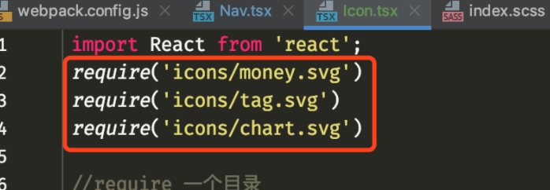
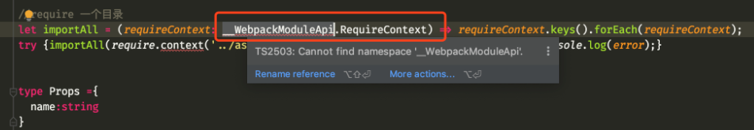

[TOC]


## why
为什么要做这个项目？
在家的时候，看见老爸老妈喜欢用纸记账，有时候感觉不方便，就有了这个想法哈;<br>

另外一方面也想输出一下自己之前学过的js和ts以及React相关的知识；<br>

设计活儿太磨人，本着熟练react& Typescript的项目实战的目的，UI和交互就没有想花太多时间去设计。
## 源代码
[Github](https://github.com/richard1230/pocketBook)


## 代码预览
[预览](https://richard1230.github.io/pocketBook-website)


## 项目过程中遇到的一些问题以及解决方案


### scss配置相关问题(怎么让React应用支持scss）
支持sass就是支持scss  <br>

1.想让React应用支持sass  <br>

2.需要node-sass，它有两个缺点：下载速度慢， <br>

3.于是用dart-sass 代替 node-sass         <br>

4.但是react只支持node-sass不支持dart-sass   <br>

5.经过努力探索                                <br>

6.发现npm 6.9支持一个新功能，叫做package alias    <br>

7.npm install node-sass@npm:dart-sass即可      <br>


### 如何优化导入的svg(如何消灭重复的导入)
问题:<br>

如果说有一百个文件夹,就需要导入100个么??? <br>



解决方法,require一个目录(写一个ts脚本来优化) <br>


```


<script lang="ts">


  let importAll = (requireContext: __WebpackModuleApi.RequireContext) => requireContext.keys().forEach(requireContext);


  try {
  importAll(require.context('../assets/icons', true, /\.svg$/));
  } catch (error)  {
  console.log(error);
  }


  export default {

    props: ['name'],

    name: 'Icon'

  };

</script>


```
又会遇到一个问题:<br>



解决:<br>

[解决方法](https://github.com/DefinitelyTyped/DefinitelyTyped/issues/11324)
```
yarn add --dev @types/webpack-env@1.15.1
```
## 总结
###  使用了联合字符串


联合类型表示一个值可以是几种类型之一; <br>


如果一个值是联合类型，我们只能访问此联合类型的所有类型里共有的成员。<br>
这个项目里面使用了联合字符串优化数字面板按钮代码 <br>


### 使用了自定义Hook
使用了useTags这一自定义Hook，实现了标签状态逻辑的复用;<br>

Hooks比较详细的介绍可以参见[阮一峰老师的教程](https://www.ruanyifeng.com/blog/2019/09/react-hooks.html)


